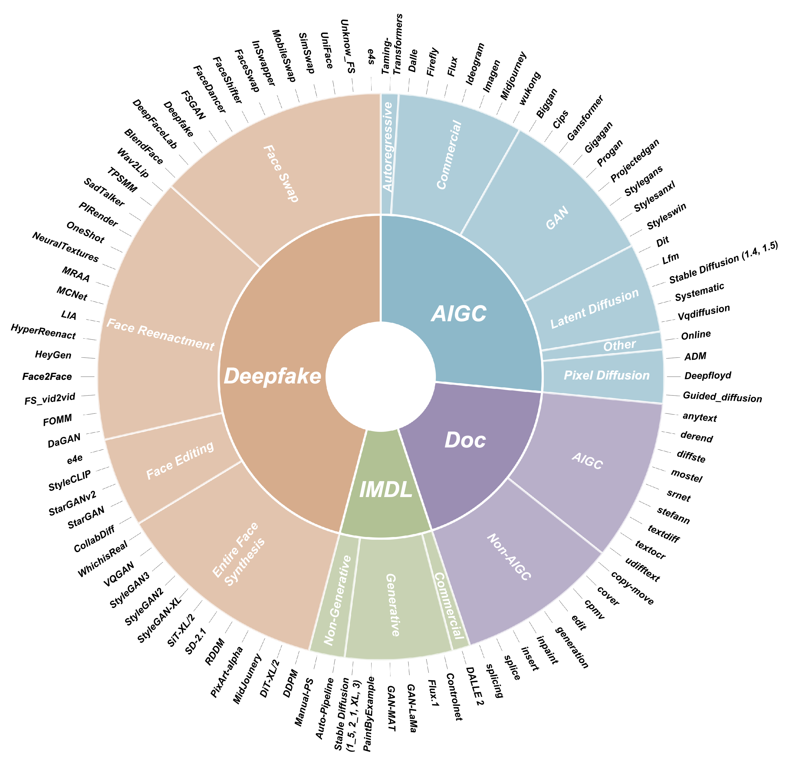

# 🛡️ [ICML'26] SICA & OpenMMSec
**Official Repository for the ICML 2026 Paper:** *"Can We Build a Monolithic Model for Fake Image Detection? SICA: Semantic-Induced Constrained Adaptation for Unified-Yet-Discriminative Artifact Feature Space Reconstruction"*

[](https://arxiv.org/pdf/2602.06676)
[](https://pan.baidu.com/s/1NYB7obv_1G-ECRvOA4zBeA?pwd=vhxy)
[](https://creativecommons.org/licenses/by-nc/4.0/)

> **Abstract:** Fake Image Detection (FID), aiming at unified detection across four image forensic subdomains, is critical in real-world forensic scenarios. Compared with ensemble approaches, monolithic FID models are theoretically more promising, but to date, consistently yield inferior performance in practice. In this work, by discovering the "heterogeneous phenomenon", which is the intrinsic distinctness of artifacts across subdomains, we diagnose the cause of this underperformance for the first time: the collapse of the artifact feature space driven by such phenomenon. The core challenge for developing a practical monolithic FID model thus boils down to the "unified-yet-discriminative" reconstruction of the artifact feature space. To address this paradoxical challenge, we hypothesize that high-level semantics can serve as a structural prior for the reconstruction, and further propose Semantic-Induced Constrained Adaptation (SICA), the first monolithic FID paradigm. Extensive experiments on our OpenMMSec dataset demonstrate that SICA outperforms 15 state-of-the-art methods and reconstructs the target unified-yet-discriminative artifact feature space in a near-orthogonal manner, thus firmly validating our hypothesis.

---

## 🗄️ The OpenMMSec Dataset

OpenMMSec aggregates data from **19** public forensic datasets and spans over **10** real-world datasets, containing over **330K** samples and covering all **4** subdomains with **98** image faking types.



### ✨ Key Features
* **Comprehensive Coverage:** Spans 4 major subdomains (Deepfake, AIGC, IMDL, Doc).
* **Massive Scale & Diversity:** Contains 333,583 images covering 15 primary faking types and 98 fine-grained faking types.
* **Balanced Distribution:** Carefully aligned the data volume across faking types to enable fair comparison, ensuring balanced data volume.
* **Rich Real-Image Sources:** Authentic images are sourced from more than 10 real-world datasets.
* **Localization Support:** We retain pixel-level masks from the original datasets (IMDL and Doc) to support future research on localization.

### 📊 Dataset Statistics

| Data Partition | # Source Datasets | Primary Type | Fine-grained Type | Real | Fake | Total |
| :--- | :---: | :---: | :---: | :---: | :---: | :---: |
| **Deepfake** | 6 | 4 | 45 | 29000 | 65636 | **94636** |
| **AIGC** | 3 | 6 | 26 | 46000 | 46048 | **91048** |
| **IMDL** | 7 | 3 | 9 | 47914 | 51000 | **98914** |
| **Doc** | 3 | 2 | 18 | 6388 | 42597 | **48985** |
| **Total** | **19** | **15** | **98** | **129302** | **204281** | **333583** |

*For generalization evaluation, we split 26 types for training (81,632 train / 8,240 validation) and the remaining 72 types for testing (243,711 test).*

## 📥 Download

OpenMMSec is released under the Creative Commons Attribution-NonCommercial 4.0 International (CC BY-NC 4.0) license. Access to the dataset is granted exclusively to researchers from educational institutes and non-profit organizations. 

You can download it via Baidu Netdisk: https://pan.baidu.com/s/1NYB7obv_1G-ECRvOA4zBeA?pwd=vhxy


---

## 🚀 Getting Started with SICA

We provide the inference and checkpoint pretrained using OpenMMSec in this repository.

You can:

1. Download the pretrained weights from the link: https://drive.google.com/drive/folders/109nJHqK-REXj5rvgpUOnzF4e0YPMBZbP?usp=sharing

The checkpoint ending with "train" was trained using only the OpenMMSec training set, while the one ending with "full" was trained on the entire OpenMMSec dataset, including both the test set and the validation set.

2. Install the required package.

3. Run inference: python inference.py --image path/to/your/image.jpg --weight path/to/your/weights.pth

We use the ForensicHub (https://github.com/scu-zjz/ForensicHub) for training. If you wish to retrain the model, you can either use the same ForensicHub framework or write your own training script. Please refer to the original paper for the relevant hyperparameters.

---

## 📜 Citation

If you find our work, SICA, or the OpenMMSec dataset useful in your research, please consider citing our paper:

```
@article{du2026can,
  title={Can We Build a Monolithic Model for Fake Image Detection? SICA: Semantic-Induced Constrained Adaptation for Unified-Yet-Discriminative Artifact Feature Space Reconstruction},
  author={Du, Bo and Ma, Xiaochen and Zhu, Xuekang and Yang, Zhe and Niu, Chaogun and Fang, Mingqi and Wang, Zhenming and Liu, Jingjing and Liu, Jian and Zhou, Ji-Zhe},
  journal={arXiv preprint arXiv:2602.06676},
  year={2026}
}
```
